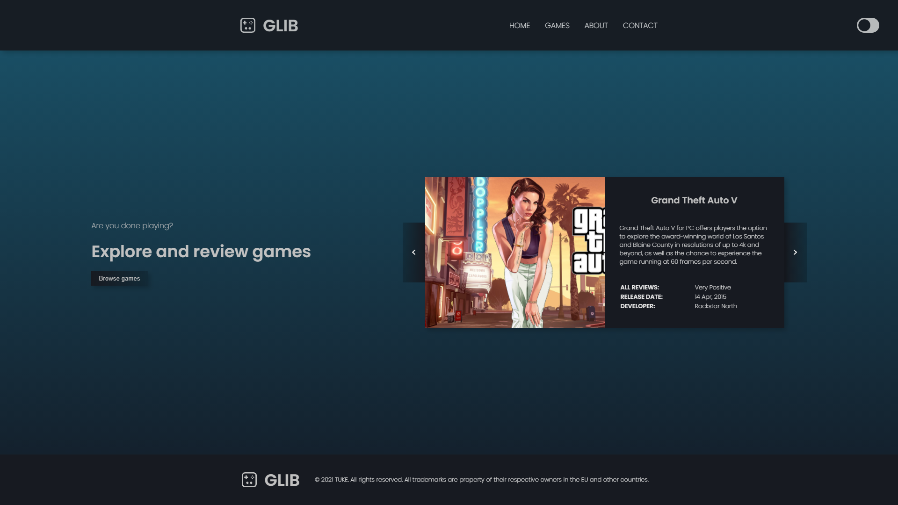

## Table of contents

- [Screenshot](#screenshot)
- [Links](#links)
- [Built with](#built-with)
- [Author](#author)

### The Title

- School project for subject AWT:

### Screenshot

### Links

- Live Site URL: [GitHub Pages](https://bckslash.github.io/index.html)

### Built with

- Semantic HTML5 markup
- CSS custom properties
- Flexbox
- JavaScript

## Author

- Twitter - [@gugl420](https://twitter.com/gugl420)